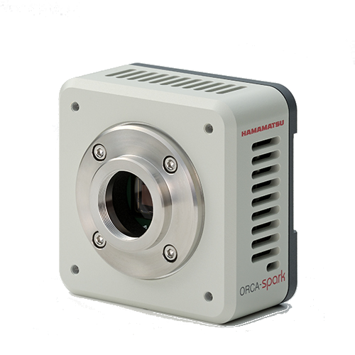

# Hamamatsu python library



This library is used to control basic features of Hamamatsu cameras. It is
composed of a core library, an optional simulator and an optional lima plugin
together with its [tango](https://tango-controls.org/) device class.

It has been tested with C11440-36U model, but should work with other models.

## Installation

From within your favorite python environment type:

`$ pip install hamamatsu`


## Usage

```python

import logging
from hamamatsu.dcam import dcam, Stream

logging.basicConfig(level=logging.INFO)

with dcam:
    camera = dcam[0]
    with camera:
        print(camera.info)
        print(camera['image_width'].value, camera['image_height'].value)

        # Simple acquisition example
        nb_frames = 10
        camera["exposure_time"] = 0.1
        with Stream(camera, nb_frames) as stream:
                logging.info("start acquisition")
                camera.start()
                for i, frame_buffer in enumerate(stream):
                    frame = copy_frame(frame_buffer)
                    logging.info(f"acquired frame #%d/%d: %s", i+1, nb_frames, frame)
                logging.info("finished acquisition")
```


## Lima

Install extra dependencies with:

`$ pip install hamamatsu[lima]`

Command line usage:

`$ limatb hamamatsu scan`

`$ limatb hamamatu -i 0 info`

`$ limatb hamamatu -i 0 dump`

`$ limatb hamamatu -i 0 acquire -n 10 -e 0.1`

### Tango

Please refer to the [Lima documentation](https://lima1.rtfd.io/en/latest/applications/tango/python/doc/index.html)

## Simulator

Only simulates a RemoteEx TCP interface.
Under development.
